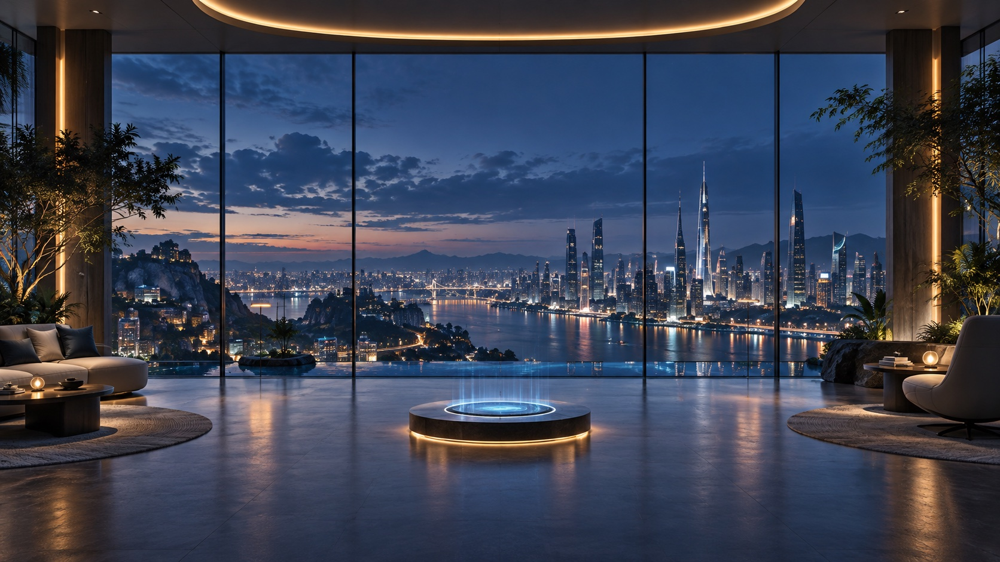

# XR Shell

A native Electron proof of concept for a panoramic workspace that is wider than the physical XREAL display. The physical display acts as a viewport into a virtual canvas up to 7× the display width. XREAL One Pro head rotation pans the canvas; right-button dragging and arrow keys provide a hardware-free simulator.

## Demo

[](artifacts/xr-shell-demo.mp4)

**[Watch or download the 48-second XR Shell feature demo →](artifacts/xr-shell-demo.mp4)**

The walkthrough highlights the panoramic head-tracked canvas, live macOS window capture, native input and spatial window controls, Accessibility-driven app theming, a complete built-in chat-to-A2UI widget creation flow, Codex and local MCP control, the shared application menu, and all five shell themes.

Open macOS windows can be brought into the workspace as live, interactive surfaces. Choose a window in the top toolbar and select **Add app**. macOS requests Screen Recording permission the first time. The mirror receives futuristic spatial chrome, depth, scan lines, color treatment and glow without modifying the original application bundle.

## Run

```bash
cd /Users/ido/Documents/xr-shell
npm install
npm start
```

Set the XREAL to an **extended display**, not mirroring. Select it in the top-right display picker and choose **Open on display**.

To control captured apps, choose **Grant Accessibility access**. The app opens **System Settings → Privacy & Security → Accessibility**; enable `input-bridge`, then return to Horizon. Horizon detects the permission automatically. Click a captured surface to select it; mouse clicks, dragging, scrolling, typing, common shortcuts and navigation keys are forwarded to the original app.

If `input-bridge` is not listed, use the **+** button in Accessibility settings, press **Command-Shift-G**, and enter `/Users/ido/Documents/xr-shell/.build/input-bridge`. If an older disabled entry exists after rebuilding, remove it with **−**, add the current helper again, and enable its switch.

To arrange the spatial workspace, drag a captured window by its holographic title bar. Drag its illuminated lower-right corner to resize it, or use the **−** and **+** buttons for coarse sizing. Manual offsets and sizes remain attached to the window when other windows are added or removed.

Choose **AX** on a captured window, then use the original app normally for five minutes. XR Shell snapshots the visible macOS Accessibility hierarchy, inventories roles, actions, attributes and parameterized attributes, highlights semantic controls over the live surface, records native AXObserver notifications, and learns structural/focus/value/state patterns by comparing snapshots. It summarizes event frequencies without persisting dynamic control values, then gives the privacy-trimmed profile to a schema-constrained Codex agent. The generated XR palette and role effects are validated, saved in `integration-profiles/<bundle-id>.json`, and applied live. If Codex is unavailable, the deterministic local theme compiler remains the fallback.

The central command deck starts real Codex CLI sessions in a read-only sandbox. XR actions proposed by those sessions pass through a local allow-listed host broker, so creating notes and launching or arranging apps does not depend on Electron/macOS app tagging or non-interactive MCP approval prompts. Sessions appear in the right-hand rail and can be selected and continued. Capturable application windows refresh every two seconds without clearing the current selection. Learned profiles compile to app-specific XR palettes and role effects; Terminal and TextEdit themes are included from the current recordings.

Captured windows expose a three-way **THEME → FX → PASS** visual control and a **FRONT** control. These modes are mutually exclusive: Theme uses only the learned app profile, FX uses only the generic holographic shell treatment, and Pass shows a near-original view. Apps without a learned theme cycle between FX and Pass. The window selector refreshes from active macOS windows every two seconds and can be refreshed manually. Width and height controls independently size the panoramic canvas. Codex sessions can be created, resumed, and removed from the session rail; removing a running session stops its local process.

The top-bar shell-theme selector changes the full XR environment independently from per-app themes. **Horizon Glass**, **Brass Observatory**, **Atomic Tomorrow**, **Starship Command**, and **Orbital Lounge** each restyle the environment, shared chrome, spatial widgets, and generic captured-window frames. The selected shell theme is saved locally and restored at launch.
The explicit **RELEASE** control stops mirroring and removes a captured window from XR Shell without closing the original macOS app.

The frontmost captured application also owns one shared menu bar near the top of the XR workspace. It mirrors the app's real macOS **File / Edit / View / Help** menus through Accessibility, supports nested items and shortcuts, and sends selected commands back to the original app. Drag the dotted handle to place the menu bar anywhere in XR space. Switching the frontmost window switches the shared menu automatically.

## Local MCP control

XR Shell includes a zero-dependency local MCP server. XR Shell must be running; the MCP process connects through a user-only Unix socket and never opens a network port.

Configure any MCP client to launch:

```json
{
  "mcpServers": {
    "xr-shell": {
      "command": "node",
      "args": ["/Users/ido/Documents/xr-shell/mcp/server.js"]
    }
  }
}
```

The core app tools are `xr_shell_list_apps`, `xr_shell_get_layout`, `xr_shell_pull_app`, `xr_shell_launch_app`, `xr_shell_focus_app`, `xr_shell_transform_app`, and `xr_shell_release_app`; the A2UI tools are described below. `xr_shell_launch_app` accepts an application name, bundle identifier, or absolute `.app` path, waits for a capturable window, attaches it, and automatically applies any matching learned profile. Apps can otherwise be addressed by the source ID returned from the list tool or by a case-insensitive window-name query. Transform coordinates are pixel offsets from the app's automatic layout slot; width and height are pixels constrained to the visible XR workspace.

XR Shell's built-in Codex chat exposes the same controls through its local allow-listed host broker, so requests such as “bring Terminal into the workspace, place it 200 pixels left, and make it 800 × 600” work without a separate approval round trip. Other local agents can use the MCP configuration above.

### A2UI surfaces

XR Shell implements a safe subset of the production A2UI v0.9.1 protocol. Agent-generated surfaces use the Basic Catalog component model and are rendered as persistent spatial widgets. XR Shell always adds its own drag handle, **Save**, and close controls, so an agent cannot create a widget that traps the user. Saved widgets appear in the top-bar **Widgets** library, where they can be turned on, turned off, or permanently deleted. Restoring a saved app layout reruns its app-and-placement recipe locally, launching missing applications before attaching their windows.

The initial use cases are:

- `xr_shell_open_layout`: opens one to three named macOS app windows, applies their requested XR positions and sizes, and creates a draggable layout controller.
- `xr_shell_add_note`: creates a draggable floating note.
- `xr_shell_a2ui_apply`: applies ordered `createSurface`, `updateComponents`, `updateDataModel`, and `deleteSurface` messages.
- `xr_shell_a2ui_capabilities`, `xr_shell_a2ui_delete`, and `xr_shell_a2ui_events`: inspect support, remove surfaces, and read explicit user events.

Rendered components are self-contained after creation. Dragging, closing, local form state, and allowlisted `mcp.call` actions run inside XR Shell without another agent turn. Only an explicit agent-directed event needs to be read by an agent. Arbitrary HTML, scripts, executable renderer functions, and unregistered components are rejected.

When profile learning finishes, XR Shell opens an intensity preview from **Light** to **Extreme** and remembers the choice for that theme. The top-bar **Profiles** library can inspect the complete local profile or its recording-derived AX summary, clear recording data while preserving the theme, or delete the entire profile.

For live tracking, connect the One Pro directly over USB-C, enable Ethernet in its developer menu, use flat Follow display mode, click **Connect XREAL**, hold still while calibration completes, and press **Recenter** while facing forward.

## Implemented

- 1.5–3.5× panoramic virtual canvas with a live minimap; 2.25× is the calmer default.
- XREAL display discovery and fullscreen placement.
- Live capture of up to twelve existing macOS application windows, with automatic canvas expansion and source-size-aware wrappers.
- Native pointer, drag, scroll, text, shortcut and navigation-key forwarding to captured windows.
- Direct spatial repositioning and constrained resizing for every captured surface.
- A shared, draggable Accessibility-backed macOS application menu for the frontmost captured app.
- A standalone local MCP server for agent-driven app discovery, capture, focus, placement, sizing and release.
- Persistent A2UI v0.9.1 spatial surfaces with local MCP actions, including app layouts and floating notes.
- Per-application Accessibility inventory and locally generated integration profiles.
- Live role-aware holographic overlays and learned UI event capabilities.
- Explicit macOS Accessibility permission boundary; input is disabled until the user grants access.
- Futuristic glass frames, spatial depth, glow and display treatment around captured apps.
- First imported window opens directly ahead and automatically recenters the head pose.
- Responsive one-, two- and three-window layouts keep captured surfaces within a comfortable head-turn range.
- Holographic shell with angular corners, animated scan, telemetry and an `FX` clarity toggle.
- One Pro USB-Ethernet discovery on TCP port `52998`.
- Fragment-safe 134-byte IMU frame parsing.
- Stationary gyro calibration, accelerometer gravity feedback, quaternion integration and recentering.
- Frame-rate-independent head-view damping and safe edge clamping.
- Mouse and keyboard simulation without glasses.
- Sandboxed renderer with a narrow preload boundary.

## Limits

- Rotation-only 3DoF; yaw can drift and may need recentering.
- No stereoscopic compositor or positional tracking.
- The virtual workspace is a panoramic application surface, not additional macOS display pixels.
- Input forwarding is experimental. Protected/DRM surfaces, secure text fields and apps with custom event handling may reject synthetic input.
- Rebuilding or moving the unsigned `input-bridge` binary can cause macOS to request Accessibility permission again.
